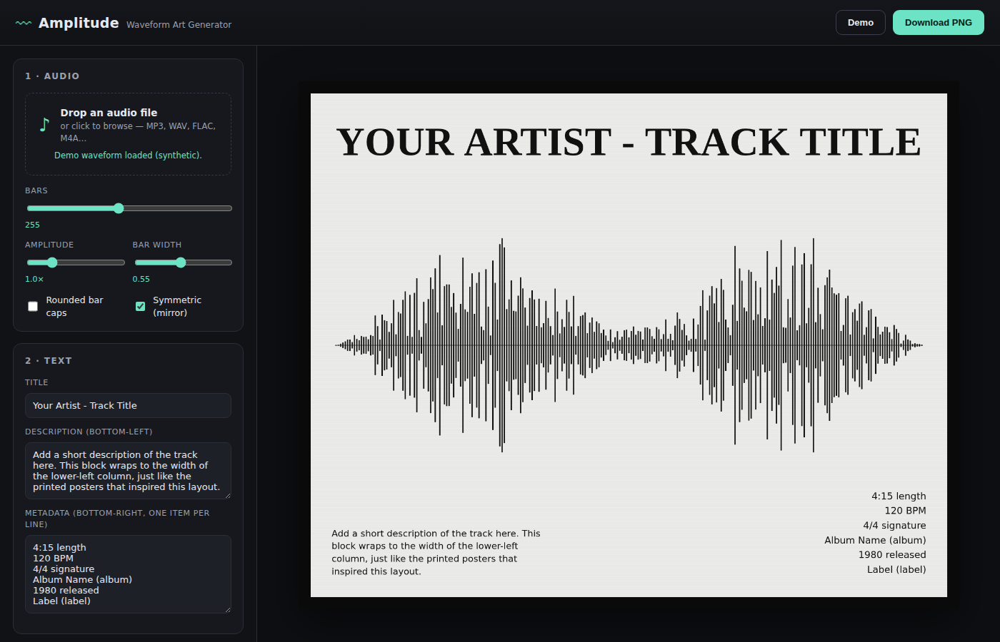

# Amplitude — Waveform Art Generator

A browser app that turns an audio file into a printable waveform poster in the
style of the "soundwave art" prints — a mirrored waveform across a center line,
a serif title, a description block, and a right-aligned metadata column.

Everything runs **entirely in your browser**. Audio is decoded locally with the
Web Audio API and never uploaded anywhere.



## Features

- **Drop in any audio file** (MP3, WAV, FLAC, M4A, OGG…) — the real waveform is
  extracted from the decoded PCM.
- **Live editing** of title, description, and a metadata column, with instant
  preview.
- **Style controls:** bar count, amplitude, bar width, rounded caps,
  symmetric/asymmetric waveform, colors, paper texture, black frame, and aspect
  ratio.
- **PNG export** at up to 4000px wide — rendered fresh at full resolution so
  text and bars stay crisp for printing.
- **SVG / vector export** — a resolution-independent copy of the poster for
  large-format printing. Bars are `<rect>`s, the title is real text, and the
  serif font is embedded in the file, so it opens self-contained in browsers,
  Illustrator, Inkscape, or a cutter/plotter.
- **Demo mode** generates a synthetic waveform so you can explore the layout
  without a file.
- Auto-fills the title from the filename and the track length from the audio
  duration.

## Run it

### Option A — single file on your desktop (recommended)

A prebuilt, fully self-contained version lives at **`dist/amplitude.html`**. It
has the CSS, JavaScript, and serif font all embedded, so you can **just
double-click it** — no server, no network, no install. Audio files you open are
read locally and never uploaded.

To regenerate it after changing the source:

```bash
node build.js        # writes dist/amplitude.html
```

### Option B — the source folder

The multi-file source (`index.html` + `css/` + `js/`) also runs directly, but
some browsers restrict `file://` pages, so serve it over HTTP:

```bash
python3 -m http.server 8000   # then open http://localhost:8000
# or:  npx serve .
```

Then drop in a song and hit **Download PNG**.

## Title style

The **Title style** selector in the Text panel offers three looks:

- **Regular (as typed)** — default; the title shows exactly as you type it,
  e.g. `Everlong - Foo Fighters`.
- **Small caps** — lowercase letters become smaller capitals while uppercase
  letters stay full height (so an acronym like `ACDC` stays full height).
- **All caps** — the whole title is uppercased.

## How the waveform is built

`computePeaks()` walks the decoded samples in `bars` equal buckets. For each
bucket it records the minimum and maximum sample value (channels mixed to
mono), which is what gives a real waveform its uneven top/bottom shape. The
peaks are normalized so the loudest point reaches the full bar height, then
`drawWaveform()` paints one thin bar per bucket around a center baseline.

Preview and export call the **same** `render()` function with different canvas
sizes, so the downloaded PNG always matches the on-screen poster. The SVG
exporter (`buildSVG()`) reuses the identical layout math — same margins, bar
positions, and title layout via the shared `computeTitleLayout()` — so the
vector output lines up with the raster one.

## Project layout

```
index.html      markup + control panel
css/style.css   dark editor UI
js/app.js       audio decoding, peak extraction, canvas rendering, PNG export
```

## Spotify metadata autofill (optional)

The **Spotify autofill** panel fills the **Title, Album, Year and Length**
fields from a track link. The waveform still comes from your audio file —
Spotify does not expose raw audio/PCM, so it can't produce a waveform.

It uses the **Authorization Code + PKCE** flow, so the app stays purely
front-end (no client secret). It requests **no scopes** — it only reads the
public catalog `/tracks` endpoint.

### One-time setup

1. Go to the [Spotify Developer Dashboard](https://developer.spotify.com/dashboard)
   and **Create app** (any name). Copy its **Client ID**.
2. **Serve the app over http** and open it via the loopback IP, e.g.:
   ```bash
   python3 -m http.server 8000
   # then open  http://127.0.0.1:8000   (use 127.0.0.1, NOT localhost)
   ```
   Spotify rejects `localhost` as a redirect target; the loopback IP works.
3. In the app's Spotify panel, copy the **Redirect URI** it shows
   (e.g. `http://127.0.0.1:8000/`) and add it under **Redirect URIs** in your
   Spotify app settings → **Save**.
4. Paste your **Client ID** into the panel, click **Connect Spotify**, and
   authorize. (A new app is in *development mode*, so only Spotify accounts you
   add under *Users and Access* — including your own — can log in.)

### Use it

Paste a track link (`https://open.spotify.com/track/…`) and click
**Autofill from track**.

### Limitations

- **Needs http(s) hosting** — the OAuth redirect can't return to a `file://`
  page, so autofill is unavailable in the double-click `dist/amplitude.html`
  bundle. Use the served version for Spotify.
- **BPM and time signature can't be filled.** They only ever came from the
  `audio-features` endpoint, which Spotify deprecated for new apps in November
  2024. Those two fields stay manual.

## Fonts

The embedded title font is **Playfair Display** by Claus Eggers Sørensen,
distributed under the [SIL Open Font License 1.1](https://openfontlicense.org/).
Only the 700-weight Latin subset (~23 KB) is bundled, for offline use.

## License

App code: MIT — do what you like. The bundled font retains its own OFL license.
